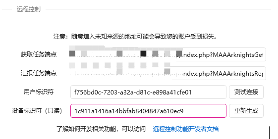

# 可交互卡片消息

## 登录你的开发者平台

### 在顶栏选择开放能力-卡片平台-新建模板

<figure><figcaption></figcaption></figure>

填写相关信息后进入搭建平台

钉钉官方的卡片开发文档[https://open.dingtalk.com/document/orgapp/overview-card-template](https://open.dingtalk.com/document/orgapp/overview-card-template)

### 下面以我的机器人的菜单为示例（菜勿喷，谢谢你QAQ）：

<figure><figcaption></figcaption></figure>

开头是markdown内容，如下

<figure><figcaption></figcaption></figure>

第二行为点击按钮后文字会改变，mode为false表示当后面传入的变量为false时，才会显示

<figure><figcaption></figcaption></figure>

下面说四个竖排按钮，每个按钮不同的功能

<figure><figcaption></figcaption></figure>

#### 回传请求

<figure><figcaption></figcaption></figure>

也就是当群u点击卡片的“用户帮助”时，钉钉服务器会向我们服务器post一段回传请求，包含了一段json为"content":{"bot\_help\_v1":"userhelp"}，我们就能知道群u点了什么东西

#### 跳转链接

<figure><figcaption></figcaption></figure>

我们想要群u点击按钮后隐藏按钮，则相对于上面的第二行为点击按钮后文字会改变

<figure><figcaption></figcaption></figure>

也就是群u点击后我们的服务器通过api请求变量mode变为false，则实现隐藏

#### 相关变量

<figure><figcaption></figcaption></figure>

做完了点右上发布，返回卡片列表就能看到卡片id喵

#### 其他没什么好讲的了...下面是框架实现

直到v231018.1-alpha，只实现了群内发卡片接收回调并改变公有内容，私有数据没有写完

```php
if ($globalmessage == "/help_new") {
    $cropidkey = read_file_to_array("config/cropid.json")[$chatbotCorpId];
    $token = get_accessToken($cropidkey['AppKey'],$cropidkey['AppSecret']);
    $cid = uuid()."-".uuid();
        $res = send_interactiveCards($token,'11175fc5-4e31-4f73-9173-ce66eea596a7.schema',$conversationId,$robotCode,1,["cardParamMap"=>["mode"=>"true","1"=>"114514","不管如何塞点东西，不然报错"=>"不然狠狠厚儒你"]],"",$cid,"xxxx");
}
```

```php
$cropidkey = read_file_to_array("config/cropid.json")[$chatbotCorpId];
$token = get_accessToken($cropidkey['AppKey'],$cropidkey['AppSecret']);
//token是钉钉api万物之源，别忘了哟~
$cid = uuid()."-".uuid(); // 超级（寄）长的uuid，保证你的卡片114514年都不会重复uuid，当然，你可以用自己的
send_interactiveCards($token,卡片id,群id,robotcode,变量替换（下面讲）,（没写完，传空值）,$cid（可选，不写就写null框架自动配置, 回调路由（可选，下面讲）); //这段才是关
```

#### 变量替换

```php
["cardParamMap"=>["mode"=>"true","1"=>"114514","不管如何塞点东西，不然报错"=>"不然狠狠厚儒你"]]
```

cardParamMap是指文本类型变量替换，多媒体类型自己看钉钉文档

变量mode为true，对应上面显示菜单按钮

1为114514代表把第二段md内容改为114514，但是由于mode不为false所以不会显示

#### 回调路由

注册回调路由：请自行完成

[https://open.dingtalk.com/document/orgapp/registration-card-interaction-callback-address-1](https://open.dingtalk.com/document/orgapp/registration-card-interaction-callback-address-1)
