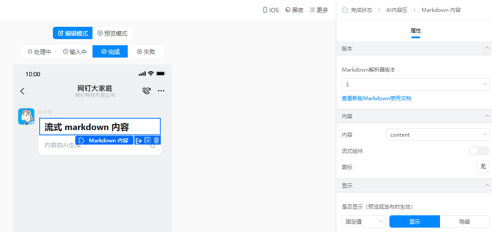

# AI卡片

使用

### 创建卡片

前往开发者后台-卡片平台

<figure><figcaption></figcaption></figure>

流式markdown的变量是 content

巴拉巴拉反正四个效果都要设置

然后记下模板 ID

### 函数

#### 创建卡片（API

```php
function create_AI_interactiveCards($token, 
$cardData, 
$outTrackId = null, 
$cardTemplateId = "8f250f96-da0f-4c9f-8302-740fa0ced1f5.schema", 
$cardOptions = ["imGroupOpenSpaceModel" => ["supportForward" => false]]
) {
```

```php
/*
token是钉钉accessToken
cardData是参数，上面设置了content变量是输出的内容，所以我们应该设置 ["content"=>打算输出的内容]
outTrackId是卡片唯一ID，如果传null则自动生成
cardTemplateId是模板ID，记得写，框架默认的是我在用的，听说可以跨企业用，挺基础的起码能用
cardOptions是卡片设置，会自动添加到最终请求API的body里，框架默认禁止转发（IM群组）
*/
```

```php
//返回为一个数组
[$res, $outTrackId]
//res为API返回
//outTrackId为唯一ID
```

#### 投放卡片（API

```php
function deliver_AI_interactiveCards($token, 
$outTrackId, 
$openSpaceId, 
$cardOptions = []
) {
```

```php
/*
token不用我多说了吧喵（
outTrackId是卡片唯一ID，应该和上面的一致
openSpaceId是场域ID，请自行参考钉钉开发者文档关于它的描述
cardOptions是卡片设置，会自动添加到最终请求API的body里
*/
```

```php
//返回为一个数组
[$res, $outTrackId]
//res为API返回
//outTrackId为唯一ID
```

#### 更新AI卡片（API

```php
function streaming_AI_interactiveCards($token, 
$outTrackId, 
$key, 
$content, 
$guid = null, 
$isFull = true, 
$isFinalize = false,
$isError = false
) {
```

```php
/*
token不用我多说了吧喵（
outTrackId是卡片唯一ID，应该和上面的一致
key是要更新的变量的名字（上文那样就是content
content是要更新的变量的值
guid是更新唯一id，传null则自动生成
isFull是是否为覆盖更新（markdown强制为true
isFinalize是是否更新完结
isError是是否为出错模式
*/
```

```php
//返回为一个数组
[$res, $outTrackId]
//res为API返回
//outTrackId为唯一ID
```

### 使用例

```php
if ($globalmessage == "aitest") {
    $cropidkey = read_file_to_array("config/cropid.json")[$chatbotCorpId];
    $token = get_accessToken($cropidkey['AppKey'],$cropidkey['AppSecret']);
    $res = create_AI_interactiveCards($token,["content"=>"114514"]);
    $res = deliver_AI_interactiveCards($token, $res[1], "dtv1.card//IM_GROUP.{$conversationId}", ["imGroupOpenDeliverModel"=>["robotCode"=>$robotCode]]);
    $res = streaming_AI_interactiveCards($token, $res[1], "content", "你说得对，但是原神");
    sleep(3);
    $res = streaming_AI_interactiveCards($token, $res[1], "content", "你说得对，但是原神是一款由迷你玩开发的");
    sleep(3);
    $res = streaming_AI_interactiveCards($token, $res[1], "content", "你说得对，但是原神是一款由迷你玩开发的开放世界冒险游戏");
    sleep(2);
    $res = streaming_AI_interactiveCards($token, $res[1], "content", "你说得对，但是原神是一款由迷你玩开发的开放世界冒险游戏", null, true, true);
    send_markdown(json_encode($res), $webhook);
}
```
